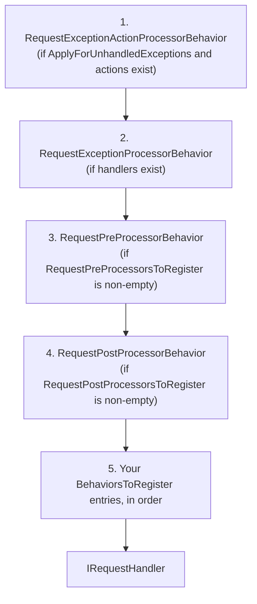

# Dependency Injection & Registration 

`AddMediatR` scans assemblies for handler implementations and registers everything needed for the mediator to run, driven by a fluent `MediatRServiceConfiguration`.

[← Back to Functionality overview](../Functionality.md)

## Entry Point

```csharp
services.AddMediatR(config =>
{
    config.RegisterServicesFromAssemblyContaining<Program>();
    // ... other configuration
});
```

`AddMediatR` (in `Microsoft.Extensions.DependencyInjection`, file `src/MediatR/MicrosoftExtensionsDI/ServiceCollectionExtensions.cs`) does:

1. Validates that at least one assembly was added to scan.
2. `ServiceRegistrar.SetGenericRequestHandlerRegistrationLimitations(configuration)` — applies the generic-registration limits.
3. `ServiceRegistrar.AddMediatRClassesWithTimeout(services, configuration)` — scans assemblies and registers handlers (with a timeout guard).
4. `ServiceRegistrar.AddRequiredServices(services, configuration)` — registers mediator, publishers, and the built-in pipeline behaviors.

## `MediatRServiceConfiguration` Options

File: `src/MediatR/MicrosoftExtensionsDI/MediatrServiceConfiguration.cs`

| Property | Default | Description |
|----------|---------|-------------|
| `AssembliesToRegister` (internal) | — | Assemblies to scan; add via `RegisterServicesFromAssembly(Containing)` |
| `TypeEvaluator` | `t => true` | Optional filter for which types to register |
| `MediatorImplementationType` | `typeof(Mediator)` | Mediator implementation to register (for custom `Mediator` subclasses) |
| `NotificationPublisher` | `new ForeachAwaitPublisher()` | Default `INotificationPublisher` instance |
| `NotificationPublisherType` | `null` | If set, overrides `NotificationPublisher`; the type is resolved from the container |
| `Lifetime` | `Transient` | Service lifetime used for mediator-related registrations |
| `RequestExceptionActionProcessorStrategy` | `ApplyForUnhandledExceptions` | When exception actions run — see [Exception Handling](Exception-Handling.md) |
| `BehaviorsToRegister` | empty | `ServiceDescriptor`s for pipeline behaviors, registered in list order |
| `StreamBehaviorsToRegister` | empty | `ServiceDescriptor`s for stream pipeline behaviors, registered in list order |
| `RequestPreProcessorsToRegister` | empty | `ServiceDescriptor`s for pre-processors, in execution order |
| `RequestPostProcessorsToRegister` | empty | `ServiceDescriptor`s for post-processors, in execution order |
| `AutoRegisterRequestProcessors` | `false` | When `true`, the assembly scan also registers `IRequestPreProcessor<>` / `IRequestPostProcessor<,>` implementations |
| `RegisterGenericHandlers` | `false` | Whether to register handlers that contain generic type parameters |
| `MaxGenericTypeParameters` | `10` | Max number of type parameters a generic request handler may have (0 disables the constraint) |
| `MaxTypesClosing` | `100` | Max number of types that may close a generic request type parameter |
| `MaxGenericTypeRegistrations` | `125000` | Max number of generic handler registrations attempted |
| `RegistrationTimeout` | `15000` ms | Timeout for the whole handler registration scan; on expiry a `TimeoutException` is thrown (0 disables it) |

Assembly registration helpers: `RegisterServicesFromAssemblyContaining<T>()`, `RegisterServicesFromAssemblyContaining(Type)`, `RegisterServicesFromAssembly(Assembly)`, `RegisterServicesFromAssemblies(params Assembly[])`.

## Fluent Registration Helpers

Besides assembly scanning, `MediatRServiceConfiguration` offers fluent helpers that add entries to the registration lists (all defaulting to `ServiceLifetime.Transient`):

| Helpers | Target list |
|---------|-------------|
| `AddBehavior<TService, TImpl>()`, `AddBehavior(Type serviceType, Type implementationType)`, `AddBehavior<TImpl>()`, `AddBehavior(Type implementationType)` | `BehaviorsToRegister` (closed registrations; single-type overloads — see caveat below) |
| `AddOpenBehavior(Type)`, `AddOpenBehaviors(IEnumerable<Type>)`, `AddOpenBehaviors(IEnumerable<OpenBehavior>)` | `BehaviorsToRegister` (open `IPipelineBehavior<,>` registrations) |
| `AddStreamBehavior(...)` (closed/open overloads) | `StreamBehaviorsToRegister` |
| `AddOpenStreamBehavior(Type)` | `StreamBehaviorsToRegister` (open `IStreamPipelineBehavior<,>`) |
| `AddRequestPreProcessor(...)` (closed overloads), `AddOpenRequestPreProcessor(Type)` | `RequestPreProcessorsToRegister` |
| `AddRequestPostProcessor(...)` (closed overloads), `AddOpenRequestPostProcessor(Type)` | `RequestPostProcessorsToRegister` |

The single-implementation-type overloads (e.g. `AddBehavior<LoggingBehavior<,>>()`) resolve the interfaces the implementation type implements and register against each of them; they throw `InvalidOperationException` if the type does not implement the expected interface.

> **Caveat (open-generic implementations):** for an open-generic implementation type these overloads derive the service type by closing the open interface with the class's *type parameters* (e.g. `IPipelineBehavior<TRequest,TResponse>`), which is not a valid open-generic service type — Microsoft DI fails at container build with `Cannot instantiate implementation type`. Use the `AddOpen*` overloads (which use `GetGenericTypeDefinition()`) for open-generic implementations, or the explicit `(serviceType, implementationType)` overloads. Closed (non-generic) implementation types work fine with the single-type overloads. See `todo.md` issue #2.

## What the Scan Registers

`ServiceRegistrar.AddMediatRClasses` (file `src/MediatR/Registration/ServiceRegistrar.cs`) scans each assembly's `DefinedTypes` and registers:

- **Request handlers** — `IRequestHandler<,>` and `IRequestHandler<>` implementations, including generic-handler closure logic (connecting open generic handler implementations to concrete request types, with the limits above).
- **Notification handlers** — `INotificationHandler<>` implementations.
- **Stream request handlers** — `IStreamRequestHandler<,>` implementations.
- **Exception handlers** — `IRequestExceptionHandler<,,>` implementations.
- **Exception actions** — `IRequestExceptionAction<,>` implementations.
- **Pre/post processors** — only when `AutoRegisterRequestProcessors` is `true`.
- **Open-generic implementations** of notification/exception/processor interfaces are additionally registered as open generics (e.g. a single `MyHandler<T>` class serves many closed types).

All scanned implementations are registered as **transient**. The registration mode differs per interface: request and stream handlers are added with `TryAddTransient` (for a given closed service type, the first implementation found wins and later ones are ignored), while notification handlers, exception handlers/actions and processors are added with `AddTransient` (every implementation is registered).

## Required Services Registration

`ServiceRegistrar.AddRequiredServices` registers (all with `TryAdd`, so pre-existing registrations win):

- `IMediator` → `MediatorImplementationType`
- `ISender` and `IPublisher` → forward to the registered `IMediator`
- `INotificationPublisher` → from `NotificationPublisherType` (if set) or the `NotificationPublisher` instance
- **Exception behaviors** — `RequestExceptionActionProcessorBehavior<,>` and/or `RequestExceptionProcessorBehavior<,>` are added as open-generic `IPipelineBehavior<,>` **only if at least one implementation of the corresponding interface is registered**, in the order dictated by `RequestExceptionActionProcessorStrategy` (see [Exception Handling](Exception-Handling.md))
- **Pre/post processor behaviors** — if `RequestPreProcessorsToRegister` / `RequestPostProcessorsToRegister` are non-empty, `RequestPreProcessorBehavior<,>` / `RequestPostProcessorBehavior<,>` are added as open-generic `IPipelineBehavior<,>`
- Entries from `BehaviorsToRegister` and `StreamBehaviorsToRegister` (added in list order)

## Registering Behaviors

`AddMediatR` does **not** scan for `IPipelineBehavior` or `IStreamPipelineBehavior` implementations. Use the `AddBehavior`/`AddOpenBehavior`/`AddStreamBehavior`/`AddOpenStreamBehavior` helpers (see [Fluent Registration Helpers](#fluent-registration-helpers)) or register manually:

```csharp
// Via configuration
services.AddMediatR(config =>
{
    config.RegisterServicesFromAssemblyContaining<Program>();
    config.BehaviorsToRegister.Add(new ServiceDescriptor(typeof(IPipelineBehavior<,>), typeof(LoggingBehavior<,>), ServiceLifetime.Transient));
    config.StreamBehaviorsToRegister.Add(new ServiceDescriptor(typeof(IStreamPipelineBehavior<,>), typeof(StreamLoggingBehavior<,>), ServiceLifetime.Transient));
});

// Or directly on the service collection (open or closed generic)
services.AddTransient<IPipelineBehavior<,>, LoggingBehavior<,>>();
services.AddTransient<IPipelineBehavior<MyRequest, MyResponse>, SpecialBehavior>();
```

For convenience, `OpenBehavior` (file `src/MediatR/Entities/OpenBehavior.cs`) is a small entity holding an `IPipelineBehavior<,>` type plus a `ServiceLifetime`; it validates the type implements `IPipelineBehavior<,>` at construction time.

## Behavior Ordering Summary

Execution order of pipeline behaviors equals **registration order** (first registered = outermost). Typical resulting order after `AddMediatR`:



1. Exception-action behavior (if `ApplyForUnhandledExceptions` and actions exist)
2. Exception-handler behavior (if handlers exist)
3. Pre-processor behavior (if `RequestPreProcessorsToRegister` is non-empty)
4. Post-processor behavior (if `RequestPostProcessorsToRegister` is non-empty)
5. Your `BehaviorsToRegister` entries, in order
