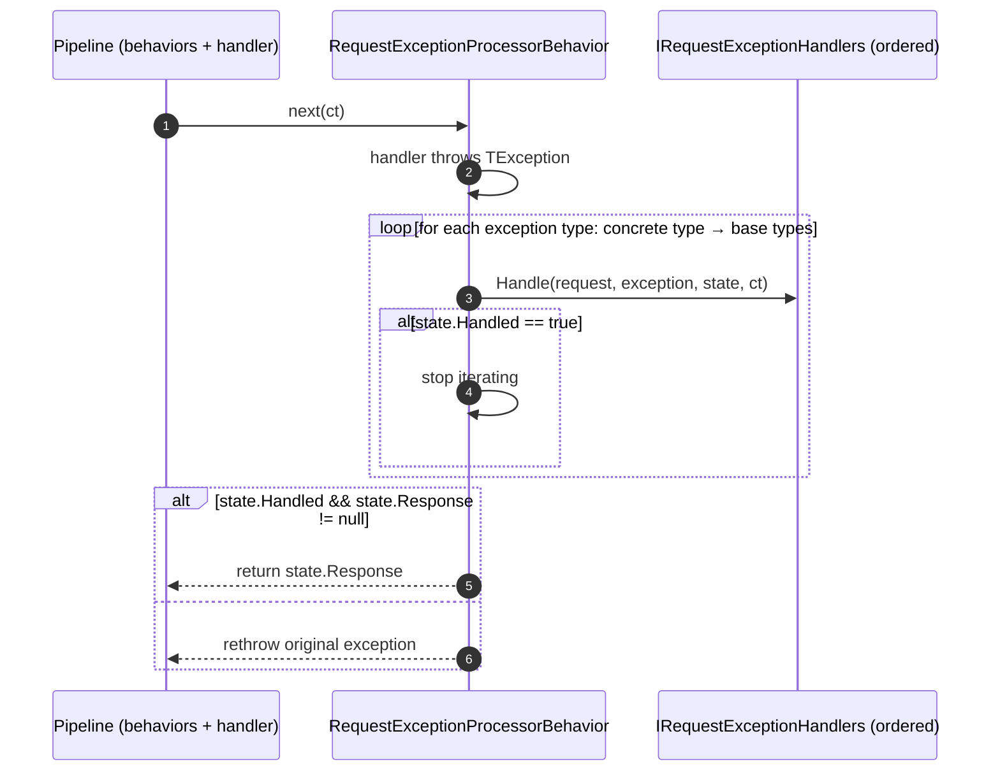
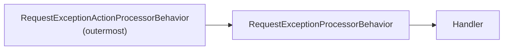
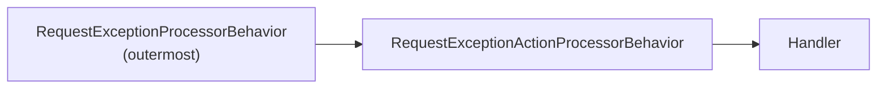

# Exception Handling 

Two complementary exception hooks for requests, both implemented as pipeline behaviors:

- **`IRequestExceptionHandler<TRequest, TResponse, TException>`** — can *handle* the exception by supplying a replacement response, so `Send` returns normally instead of throwing.
- **`IRequestExceptionAction<TRequest, TException>`** — a fire-and-forget side effect (e.g. logging, metrics, alerting); the original exception is always rethrown afterwards.

[← Back to Functionality overview](../Functionality.md)

## Key Types

| Type | File | Role |
|------|------|------|
| `IRequestExceptionHandler<TRequest, TResponse, TException>` | `src/MediatR/Pipeline/IRequestExceptionHandler.cs` | Exception handler contract (may replace response) |
| `RequestExceptionHandlerState<TResponse>` | `src/MediatR/Pipeline/RequestExceptionHandlerState.cs` | State object: `Handled` flag + replacement `Response` |
| `RequestExceptionProcessorBehavior<TRequest, TResponse>` | `src/MediatR/Pipeline/RequestExceptionProcessorBehavior.cs` | Behavior invoking exception handlers |
| `IRequestExceptionAction<TRequest, TException>` | `src/MediatR/Pipeline/IRequestExceptionAction.cs` | Exception action contract (side effects only) |
| `RequestExceptionActionProcessorBehavior<TRequest, TResponse>` | `src/MediatR/Pipeline/RequestExceptionActionProcessorBehavior.cs` | Behavior invoking exception actions |
| `RequestExceptionActionProcessorStrategy` | `src/MediatR/MicrosoftExtensionsDI/RequestExceptionActionProcessorStrategy.cs` | Controls when actions run |

## Exception Handlers (response replacement)

```csharp
public class NotFoundHandler : IRequestExceptionHandler<GetUser, User, NotFoundException>
{
    public Task Handle(GetUser request, NotFoundException exception,
        RequestExceptionHandlerState<User> state, CancellationToken cancellationToken)
    {
        state.SetHandled(User.Anonymous);   // exception considered handled
        return Task.CompletedTask;
    }
}
```



Semantics of `RequestExceptionProcessorBehavior`:

1. If the pipeline throws, the behavior walks the **exception type hierarchy** (most-derived type first, then each base type) and collects all registered handlers for each level.
2. Handlers are invoked in order; after each one, if `state.Handled` is `true`, iteration stops.
3. If a handler called `state.SetHandled(response)`, `Send` returns that response instead of throwing.
4. If no handler handled the exception (or a handler marked it handled without a response), the **original exception is rethrown**.

Notes:

- Handlers are resolved from the service provider per request type via `IEnumerable<IRequestExceptionHandler<TRequest, TResponse, TException>>` and prioritized by specificity (see [Handler Ordering](Handler-Ordering.md)).
- Handlers are invoked via reflection on the closed generic interface. A handler registered for exception type `E` is invoked for any thrown exception assignable to `E` (the hierarchy walk reaches `E`); in particular, a handler registered for `Exception` catches everything.
- Handler exceptions are unwrapped from `TargetInvocationException` and rethrown as-is.

## Exception Actions (side effects)

```csharp
public class LogExceptions : IRequestExceptionAction<GetUser, Exception>
{
    private readonly ILogger _logger;
    public LogExceptions(ILoggerFactory factory) => _logger = factory.CreateLogger("MediatR");

    public Task Execute(GetUser request, Exception exception, CancellationToken cancellationToken)
    {
        _logger.LogError(exception, "Request {Request} failed", typeof(GetUser).Name);
        return Task.CompletedTask;
    }
}
```

`RequestExceptionActionProcessorBehavior` collects all matching actions (same exception-type-hierarchy walk and specificity ordering), awaits each one, and then **always rethrows** the original exception. Actions cannot suppress the exception.

## When Actions Run: `RequestExceptionActionProcessorStrategy`

Configured in `MediatRServiceConfiguration`. The two strategies differ only in where the two behaviors sit in the pipeline:

`ApplyForUnhandledExceptions` (default) — actions outside, handlers inside:



`ApplyForAllExceptions` — handlers outside, actions inside:



| Strategy | Behavior |
|----------|----------|
| `ApplyForUnhandledExceptions` (default) | Exception actions run only if no exception **handler** marked the exception handled. The action behavior is registered *before* the handler behavior, so if a handler swallows the exception, actions never see it. |
| `ApplyForAllExceptions` | Exception actions always run, even when a handler replaced the response. The action behavior is registered *after* the handler behavior, i.e. *inside* it (closer to the handler), so actions run first and the handler behavior can still handle the exception afterwards. |

The strategy only changes the relative **registration order** of the two built-in behaviors (both are registered as open-generic `IPipelineBehavior<,>` when matching implementations exist).

## Composition

Both behaviors are ordinary pipeline behaviors, so they compose with your own behaviors, pre/post processors, and each other — see [Pipeline Behaviors](Pipeline-Behaviors.md) and [Dependency Injection](Dependency-Injection.md) for registration details.
