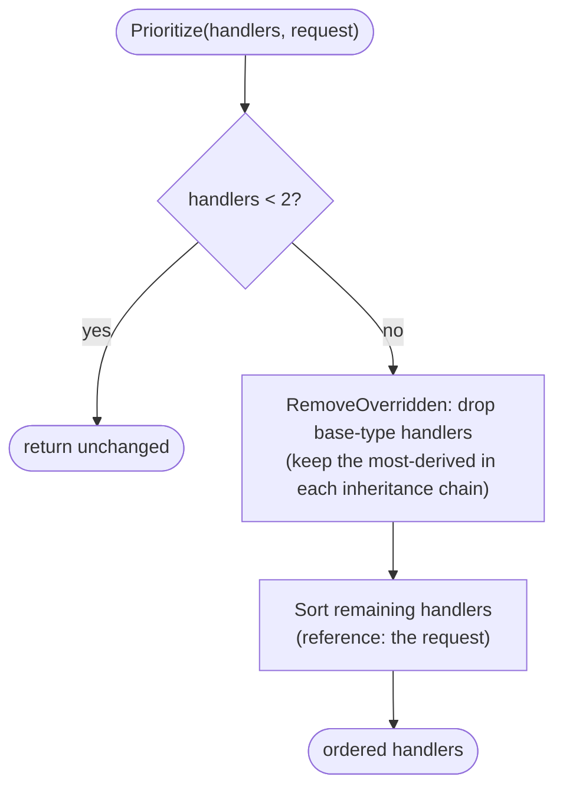

# Handler Ordering

When several registered handler instances could serve the same request (typically because an exception handler/action for a base exception type and one for a derived type both match, or multiple implementations are registered), MediatR must decide **which one wins** and in what order they run. This is done by the internal `HandlersOrderer`.

[← Back to Functionality overview](../Functionality.md)

## Key Types (internal)

| Type | File | Role |
|------|------|------|
| `HandlersOrderer` | `src/MediatR/Internal/HandlersOrderer.cs` | Prioritizes a list of handler instances for a request |
| `ObjectDetails` | `src/MediatR/Internal/ObjectDetails.cs` | Per-handler metadata (type, assembly, namespace) used as the comparer |

## Where It's Used

`HandlersOrderer.Prioritize(handlers, request)` is applied to handler collections resolved from the service provider in:

- `RequestExceptionProcessorBehavior` — ordering `IRequestExceptionHandler<TRequest, TResponse, TException>` instances
- `RequestExceptionActionProcessorBehavior` — ordering `IRequestExceptionAction<TRequest, TException>` instances

Both then de-duplicate by handler type (first instance of each concrete type wins) before invoking them.

## Algorithm

`Prioritize<TRequest>(IList<object> handlers, TRequest request)`:

1. **Fast path** — if there is at most one handler, return it unchanged.
2. Build an `ObjectDetails` for the request (its type's assembly name and namespace) and for each handler instance.
3. **Remove overridden handlers** (`RemoveOverridden`) — for every pair, if one handler's type is assignable from the other's (i.e. one is a base type of the other), the base-type handler is marked overridden and removed. This keeps only the most-derived handler in an inheritance chain.
4. **Sort** the remaining handlers with `ObjectDetails` as the comparer, using the request as the reference point.

## Comparison Criteria (`ObjectDetails.CompareTo`)

Handlers are compared against each other, using the *request's* assembly/namespace as the reference, in this priority order (first criterion that decides wins):

1. **Assembly** — a handler in the same assembly as the request outranks a handler in a different assembly.
2. **Namespace** — a handler whose namespace equals the request's namespace or is a child of it outranks a handler in an unrelated namespace.
3. **Namespace proximity** — when neither handler is in the request's namespace (or a child of it), a handler located in an *ancestor* namespace of the request's namespace wins; between two such ancestors, the deeper (longer) namespace wins.

Intuition: the handler that lives "next to" the request (same assembly, closest namespace) is considered the most specific/most relevant implementation and runs first.

## Properties

- The types are `internal` — this is library-internal behavior, not a public extension point.
- Ordering only matters when multiple matching handlers exist; with a single registered handler it is a no-op.
- After ordering, the calling behaviors group by concrete handler type and keep the first instance, so each distinct handler implementation runs at most once.
