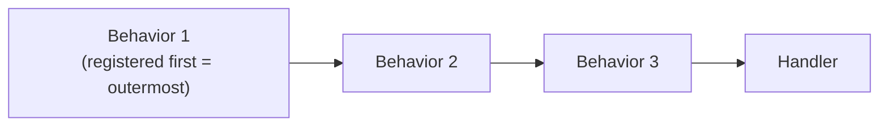

# Pipeline Behaviors

Pipeline behaviors wrap request handling in a chain, enabling cross-cutting concerns (logging, authorization, caching, transaction scope, etc.) without modifying handlers.

[← Back to Functionality overview](../Functionality.md)

## Key Types

| Type | File | Role |
|------|------|------|
| `IPipelineBehavior<TRequest, TResponse>` | `src/MediatR/IPipelineBehavior.cs` | Behavior contract |
| `RequestHandlerDelegate<TResponse>` | `src/MediatR/IPipelineBehavior.cs` | Delegate representing the next step in the pipeline |
| `RequestHandlerWrapperImpl` | `src/MediatR/Wrappers/RequestHandlerWrapper.cs` | Composes behaviors around the handler at send time |

## The Contract

```csharp
public interface IPipelineBehavior<in TRequest, TResponse> where TRequest : notnull
{
    Task<TResponse> Handle(TRequest request, RequestHandlerDelegate<TResponse> next, CancellationToken cancellationToken);
}
```

A behavior performs work before/after calling `next()`, or skips the pipeline entirely by never calling it.

```csharp
public class LoggingBehavior<TRequest, TResponse> : IPipelineBehavior<TRequest, TResponse>
{
    private readonly ILogger _logger;

    public LoggingBehavior(ILoggerFactory loggerFactory)
        => _logger = loggerFactory.CreateLogger<TRequest>();

    public async Task<TResponse> Handle(TRequest request, RequestHandlerDelegate<TResponse> next, CancellationToken cancellationToken)
    {
        _logger.LogInformation("Sending {RequestType}", typeof(TRequest).Name);
        var response = await next(cancellationToken);
        _logger.LogInformation("Received {Response}", response);
        return response;
    }
}
```

## How the Pipeline Is Composed



In `RequestHandlerWrapperImpl<TRequest, TResponse>.Handle`:

1. A `Handler` delegate is created that resolves the actual `IRequestHandler<TRequest, TResponse>` from the service provider and invokes it.
2. All registered `IPipelineBehavior<TRequest, TResponse>` services are retrieved, **reversed**, and aggregated so that each behavior wraps the next inner delegate.
3. The result is invoked with the cancellation token.

Consequences:

- **Registration order = execution order.** The first-registered behavior is the outermost layer (runs first on the way in, last on the way out).
- A behavior registered as a closed generic (e.g. `IPipelineBehavior<MyRequest, MyResponse>`) applies only to that request/response pair; open-generic registrations (`IPipelineBehavior<,>`) apply to all requests.
- Void requests use `Unit` as the response type (`IPipelineBehavior<TRequest, Unit>`).

## Built-in Behaviors

The library ships several built-in pipeline behaviors that implement its processor/exception features (all in `src/MediatR/Pipeline/`):

| Behavior | Implements feature | Docs |
|----------|--------------------|------|
| `RequestPreProcessorBehavior<TRequest, TResponse>` | `IRequestPreProcessor` execution | [Request Processors](Request-Processors.md) |
| `RequestPostProcessorBehavior<TRequest, TResponse>` | `IRequestPostProcessor` execution | [Request Processors](Request-Processors.md) |
| `RequestExceptionProcessorBehavior<TRequest, TResponse>` | `IRequestExceptionHandler` execution | [Exception Handling](Exception-Handling.md) |
| `RequestExceptionActionProcessorBehavior<TRequest, TResponse>` | `IRequestExceptionAction` execution | [Exception Handling](Exception-Handling.md) |

They are registered automatically by `AddMediatR`: the exception behaviors when implementations of the corresponding interfaces are registered, and the processor behaviors when pre/post processors are registered via configuration (see [Dependency Injection](Dependency-Injection.md)).
