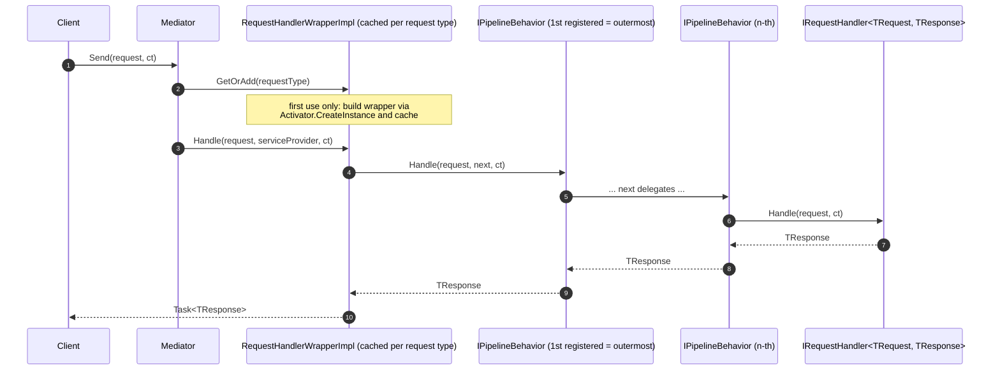

# Request/Response Pattern

The core request/response pattern: a client sends an `IRequest<TResponse>` to the mediator, and exactly **one** handler produces a response.

[← Back to Functionality overview](../Functionality.md)

## Key Types

| Type | File | Role |
|------|------|------|
| `IRequest<TResponse>` | `src/MediatR/IRequest.cs` | Marker interface for a request with a response |
| `IRequest` | `src/MediatR/IRequest.cs` | Marker interface for a request without a response (void) |
| `IBaseRequest` | `src/MediatR/IRequest.cs` | Common base allowing generic constraints on either request kind |
| `IRequestHandler<TRequest, TResponse>` | `src/MediatR/IRequestHandler.cs` | Handler contract (response version) |
| `IRequestHandler<TRequest>` | `src/MediatR/IRequestHandler.cs` | Handler contract (void version) |
| `Unit` | `src/MediatR/Unit.cs` | Empty response type used internally for void requests |
| `ISender` | `src/MediatR/ISender.cs` | Interface exposing `Send` operations |
| `IMediator` | `src/MediatR/IMediator.cs` | `ISender` + `IPublisher` |
| `Mediator` | `src/MediatR/Mediator.cs` | Default mediator implementation |

## Defining a Request and Handler

```csharp
public record GetWeatherReport(string ZipCode) : IRequest<WeatherReport>;

public class GetWeatherReportHandler : IRequestHandler<GetWeatherReport, WeatherReport>
{
    public Task<WeatherReport> Handle(GetWeatherReport request, CancellationToken cancellationToken)
        => Task.FromResult(new WeatherReport { ZipCode = request.ZipCode });
}
```

Requests without a response use `IRequest` (no type argument) and the single-parameter `IRequestHandler<TRequest>`; the mediator internally wraps the result in `Unit`.

## Sending Requests

`ISender` (and therefore `IMediator`) exposes three `Send` overloads:

```csharp
// Strongly-typed send (TResponse inferred)
var report = await mediator.Send(new GetWeatherReport("12345"));

// Send a void request
await mediator.Send(new DoSomething());

// Object send (dynamic dispatch, type-erased response)
var response = await mediator.Send((object)new GetWeatherReport("12345"));
```

### How `Mediator.Send` Works

- The `Mediator` keeps a `ConcurrentDictionary<Type, RequestHandlerBase>` of cached **handler wrappers**.
- On the first `Send` for a request type, it builds a closed generic `RequestHandlerWrapperImpl<TRequest, TResponse>` (see `Wrappers/RequestHandlerWrapper.cs`) via `Activator.CreateInstance`, and caches it.
- The wrapper composes the pipeline at call time: it resolves all registered `IPipelineBehavior<TRequest, TResponse>` services, reverses them, and aggregates them around a delegate that resolves and invokes the actual `IRequestHandler`.
- The object-based `Send(object)` overload resolves the response type from the request's `IRequest<TResponse>` interface and uses dynamic dispatch to avoid per-call reflection.

### Flow



## Notes

- Only **one** handler is invoked per request. Request handlers are registered with `TryAddTransient`, so if several implementations exist for the same request type, the first one found during assembly scanning wins and the rest are silently ignored. (The specificity ordering described in [Handler Ordering](Handler-Ordering.md) applies only to exception handlers/actions, not to request handlers.)
- Requests flow through all registered pipeline behaviors in registration order — the first registered behavior is the outermost — see [Pipeline Behaviors](Pipeline-Behaviors.md).
- Streaming requests (`CreateStream`) are documented separately in [Streaming Requests](Streaming-Requests.md).
