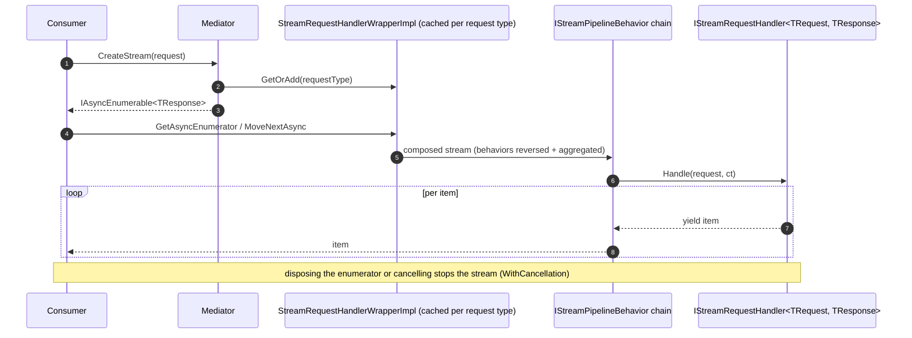

# Streaming Requests 

Streaming requests extend the request pattern to responses produced incrementally, returned as `IAsyncEnumerable<TResponse>` and consumed with `await foreach`.

[← Back to Functionality overview](../Functionality.md)

## Key Types

| Type | File | Role |
|------|------|------|
| `IStreamRequest<TResponse>` | `src/MediatR/IStreamRequest.cs` | Marker interface for a streaming request |
| `IStreamRequestHandler<TRequest, TResponse>` | `src/MediatR/IStreamRequestHandler.cs` | Streaming handler contract |
| `IStreamPipelineBehavior<TRequest, TResponse>` | `src/MediatR/IStreamPipelineBehavior.cs` | Streaming pipeline behavior contract |
| `StreamHandlerDelegate<TResponse>` | `src/MediatR/IStreamPipelineBehavior.cs` | Delegate representing the next step in a stream pipeline |
| `ISender.CreateStream` | `src/MediatR/ISender.cs` | Mediator entry points for streams |
| `StreamRequestHandlerWrapperImpl` | `src/MediatR/Wrappers/StreamRequestHandlerWrapper.cs` | Composes stream pipeline around the handler |

## Defining a Streaming Request and Handler

```csharp
public record GetSensorReadings(string SensorId) : IStreamRequest<SensorReading>;

public class GetSensorReadingsHandler : IStreamRequestHandler<GetSensorReadings, SensorReading>
{
    public async IAsyncEnumerable<SensorReading> Handle(
        GetSensorReadings request,
        [EnumeratorCancellation] CancellationToken cancellationToken)
    {
        while (!cancellationToken.IsCancellationRequested)
        {
            yield return await ReadSensorAsync(request.SensorId, cancellationToken);
            await Task.Delay(1000, cancellationToken);
        }
    }
}
```

## Consuming the Stream

`ISender` (and therefore `IMediator`) exposes two `CreateStream` overloads:

```csharp
// Strongly-typed stream
await foreach (var reading in mediator.CreateStream(new GetSensorReadings("s-1")))
{
    Console.WriteLine(reading.Value);
}

// Object-based stream (type-erased, items as object?)
await foreach (var item in mediator.CreateStream((object)new GetSensorReadings("s-1")))
{
    Console.WriteLine(item);
}
```

## How `Mediator.CreateStream` Works

- The `Mediator` keeps a `ConcurrentDictionary<Type, StreamRequestHandlerBase>` of cached **stream handler wrappers**.
- On first use, it builds a closed generic `StreamRequestHandlerWrapperImpl<TRequest, TResponse>` via `Activator.CreateInstance` and caches it.
- The wrapper composes the stream pipeline: it resolves all registered `IStreamPipelineBehavior<TRequest, TResponse>` services, reverses them, and aggregates them around a delegate that resolves and invokes the `IStreamRequestHandler`.
- The wrapper's enumeration methods are declared with `[EnumeratorCancellation] CancellationToken` and apply `WithCancellation(cancellationToken)`, so disposing the enumerator or cancelling the token stops the stream.
- The object-based overload throws `ArgumentException` if the request type does not implement `IStreamRequest<TResponse>`.

### Flow



## Streaming Pipeline Behaviors

`IStreamPipelineBehavior<TRequest, TResponse>` mirrors `IPipelineBehavior`, but works with `IAsyncEnumerable<TResponse>` instead of a single value:

```csharp
public class StreamLoggingBehavior<TRequest, TResponse> : IStreamPipelineBehavior<TRequest, TResponse>
{
    public async IAsyncEnumerable<TResponse> Handle(
        TRequest request,
        StreamHandlerDelegate<TResponse> next,
        [EnumeratorCancellation] CancellationToken cancellationToken)
    {
        await foreach (var item in next().WithCancellation(cancellationToken))
        {
            yield return item;
        }
    }
}
```

- `next()` is a `StreamHandlerDelegate<TResponse>` (`delegate IAsyncEnumerable<TResponse> StreamHandlerDelegate<TResponse>()`) that lazily starts the next step.
- Behaviors can buffer, transform, filter, or re-emit items; they should dispose/complete enumeration when done.
- Like request behaviors, **registration order = pipeline order** (first registered is outermost). Stream behaviors are registered via `MediatRServiceConfiguration.AddStreamBehavior` / `AddOpenStreamBehavior` (or directly into `StreamBehaviorsToRegister`), or by adding `IStreamPipelineBehavior` service descriptors — see [Dependency Injection](Dependency-Injection.md).

## Differences from Regular Requests

| Aspect | `IRequest<T>` | `IStreamRequest<T>` |
|--------|--------------|---------------------|
| Response | single `Task<T>` | `IAsyncEnumerable<T>` |
| Handler interface | `IRequestHandler<,>` | `IStreamRequestHandler<,>` |
| Pipeline behavior | `IPipelineBehavior<,>` | `IStreamPipelineBehavior<,>` |
| Mediator method | `Send` | `CreateStream` |
| Cancellation | `CancellationToken` parameter | `CancellationToken` + enumerator disposal |
